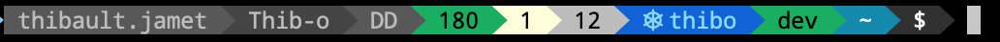

# powerline-go-datadog
powerline-go plugin that shows datadog's monitors in warning, alert or nodata
Inspired from [i3blocks-datadog](https://github.com/alanbover/i3blocks-datadog)



## How to install powerline-go-datadog

### 0. Prerequisite

Use a custom [powerline-go](https://github.com/tjamet/powerline-go/) project that supports plugins

### 1. Build the application
First of all, you will need to build the project. For this, just execute:

```
go get -u github.com/tjamet/powerline-go-datadog
go build -o /usr/local/bin/powerline-go-datadog
```

Ensure you have `/usr/local/bin/` in your `$PATH`

### 2. Add datadog plugin segment
You need to edit your powerline-go configuration to add the plugin segment in your `~/.profile`

example:

```
PS1="$(powerline-go -error $? -modules user,host,docker,kube,cwd,perms,git,jobs,exit,root)"
```

### 3. Inject your credentials

Update your `~/.netrc` file add:

```
machine api.datadoghq.com
  login <appKey>
  password <apiKey>
```

### 4. Profit!
